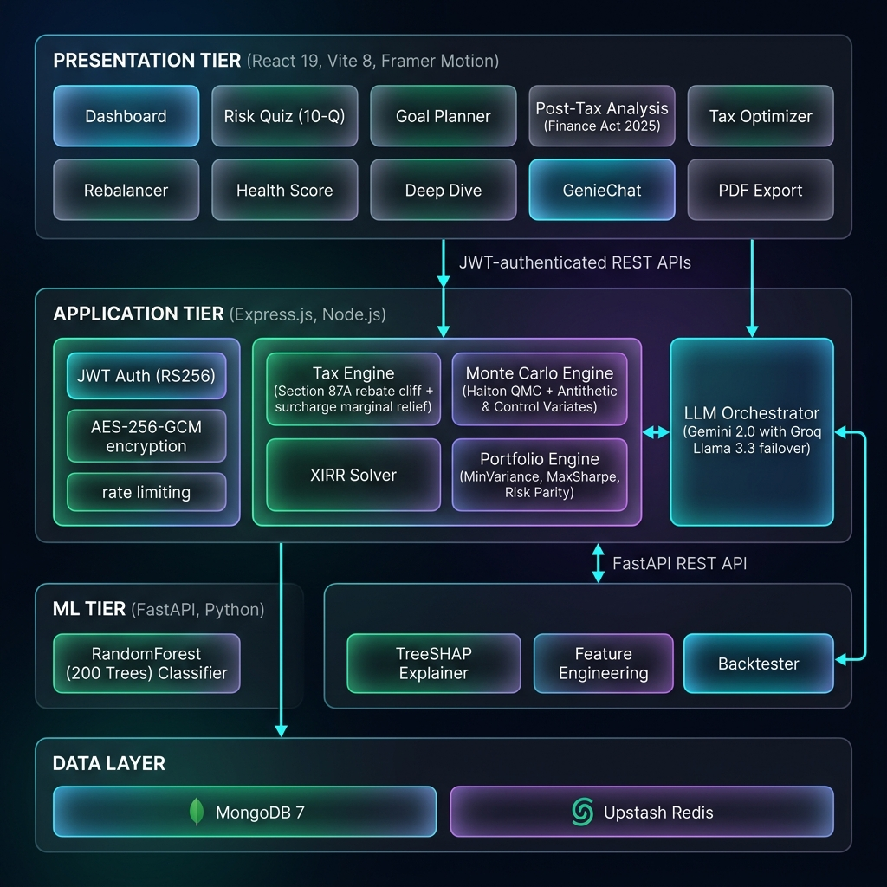
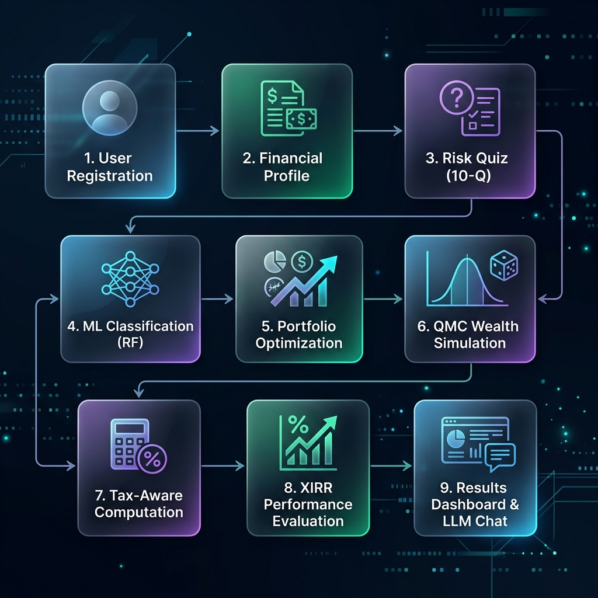

<p align="center">
  
  
  
  
  
  
  
  
</p>

<h1 align="center">WealthGenie: AI-Based Personalized Financial
Advisory System
</h1>
<h3 align="center">AI-Powered Personalized Financial Advisory System</h3>

<p align="center">
  <strong>A research-grade, three-tier robo-advisory platform integrating Quasi-Monte Carlo simulation, explainable ML (TreeSHAP), progressive tax optimization under Indian Finance Act 2025, and LLM-powered conversational advisory — with an accompanying IEEE-format research paper.</strong>
</p>

<p align="center">
  <a href="#-architecture">Architecture</a> •
  <a href="#-key-features">Features</a> •
  <a href="#-computational-engines">Engines</a> •
  <a href="#-quick-start">Quick Start</a> •
  <a href="#-api-reference">API Reference</a> •
  <a href="#-research-paper">Research</a>
</p>

---

## 📋 Table of Contents

- [About the Project](#-about-the-project)
- [Architecture](#-architecture)
- [Key Features](#-key-features)
- [Computational Engines](#-computational-engines)
- [Technology Stack](#-technology-stack)
- [Project Structure](#-project-structure)
- [Quick Start](#-quick-start)
- [Environment Variables](#-environment-variables)
- [API Reference](#-api-reference)
- [ML Pipeline & Explainability](#-ml-pipeline--explainability)
- [Security & Hardening](#-security--hardening)
- [Testing](#-testing)
- [Performance Benchmarks](#-performance-benchmarks)
- [Research Paper](#-research-paper)
- [Financial Glossary](#-financial-glossary)
- [Author](#-author)
- [License](#-license)

---

## 🎯 About the Project

Indian retail investors face a multi-objective financial planning challenge that spans stochastic wealth projection, heterogeneous capital-gains taxation, and regulatory rebate discontinuities. Existing robo-advisory platforms address these concerns in isolation — offering either deterministic growth calculators that ignore sequence-of-returns risk, or opaque recommendation engines that provide no decision rationale.

**WealthGenie** is a modular, three-tier platform that unifies **four domain-specific computational engines** within a single advisory workflow:

| Engine | Problem Solved |
|:---|:---|
| **Quasi-Monte Carlo Simulator** | Replaces deterministic CAGR projections with probabilistic wealth bands (P₁₀, P₅₀, P₉₀) that capture sequence-of-returns risk |
| **Hybrid XIRR Solver** | Computes exact annualized returns for irregular SIP cash-flow schedules with guaranteed convergence |
| **Portfolio Optimizer** | Constructs optimal allocations via MinVariance, MaxSharpe, and Risk Parity strategies with simplex-projected gradient descent |
| **Progressive Tax Engine** | Precisely models Section 87A rebate cliffs, surcharge marginal relief, and 7-slab progressive taxation under Finance Act 2025 |

All recommendations are explained via **TreeSHAP** feature attributions, and a dual-LLM conversational interface (**Gemini 2.0 → Groq Llama 3.3** failover) provides natural-language advisory grounded in validated computational outputs.

> **📄 This project is accompanied by a full IEEE-format research paper** validating the mathematical models, variance reduction techniques, and system architecture. See the [Research Paper](#-research-paper) section.

---

## 🏗 Architecture

WealthGenie operates on a **decoupled three-tier service-oriented architecture** communicating over stateless REST APIs:

<p align="center">
  
</p>

### Data Flow (9-Stage Pipeline)

<p align="center">
  
</p>

---

## ✨ Key Features

### 🔮 Stochastic Wealth Projection
- **Quasi-Monte Carlo simulation** using Halton low-discrepancy sequences replaces deterministic CAGR projections
- **Antithetic variates** and **multiplicative control variates** achieve **96%+ variance reduction** vs naive Monte Carlo
- Renders probabilistic wealth bands (**P₁₀, P₅₀, P₉₀**) capturing sequence-of-returns risk for SIP investors
- Sub-100ms response times via Halton's $O(N^{-1}(\ln N)^d)$ convergence rate

### 📊 Portfolio Optimization (3 Strategies)
- **Minimum Variance** — Minimizes $w^T \Sigma w$ for lowest-risk allocation
- **Maximum Sharpe** — Maximizes risk-adjusted excess return $(w^T\mu - R_f) / \sqrt{w^T\Sigma w}$
- **Equal Risk Contribution (Risk Parity)** — Equalizes marginal risk contributions across all assets
- All solvers use **simplex-projected gradient descent** enforcing fully-invested and long-only constraints

### 🧠 Explainable AI (XAI)
- **Random Forest** ensemble classifier (200 trees) maps investor profiles to recommended primary financial instruments (e.g., Equity Mutual Funds, ETFs, ELSS, Fixed Deposits, Gold, or RBI Bonds)
- **TreeSHAP** computes exact Shapley values satisfying efficiency, symmetry, and dummy axioms
- Feature attributions decompose every recommendation into auditable, human-readable explanations
- **100× faster** than KernelSHAP (2.4ms vs 240ms inference time)

### 💰 Indian Tax Engine (Finance Act 2025)
- 7-slab progressive tax computation (0% → 30%)
- **Section 87A rebate cliff** with marginal relief — precisely handles the ₹12,00,000 threshold discontinuity
- Surcharge tiers (10% / 15% / 25%) with surcharge marginal relief
- 4% Health & Education Cess
- Old vs New regime comparison
- Post-tax capital gains analysis (LTCG / STCG / EEE classification)

### 💬 Dual-LLM Advisory Chat
- **Primary**: Google Gemini 2.0 with context injection from validated computational outputs
- **Failover**: Groq Llama 3.3 with deterministic FSM-based prompt reformatting
- Prompt caching via Upstash Redis (30-minute TTL) to reduce LLM token costs
- Context-grounded responses prevent financial hallucination

### 🛡️ Production-Grade Security
- bcrypt password hashing (cost factor 10)
- JWT RS256 authentication with configurable expiration
- Timing-attack resistant login (100–300ms randomized delays)
- Rate limiting (10 auth / 60 API requests per window)
- Helmet.js security headers, NoSQL injection prevention, CSP policies
- Sensitive financial data is protected by authentication, authorization, validation, and database access controls; this codebase does not implement application-level field encryption

### 📱 Premium UI/UX
- Dark-themed glassmorphic dashboard with **Framer Motion** micro-animations
- 3D tilt cards, animated background orbs, staggered reveal animations
- 15+ interactive screens: Dashboard, Tax Optimizer, Goal Planner, Rebalancer, Health Score, Deep Dive, Comparison Table, SIP Step-Up Planner, Post-Tax Analysis, and more
- PDF export via html2canvas + jsPDF
- SEBI disclaimer compliance
- Custom financial **Jargon Tooltips** for investor education

---

## ⚙️ Computational Engines

### 1. Quasi-Monte Carlo Simulator (`monteCarloEngine.js`)

Models wealth growth via **Geometric Brownian Motion** with monthly SIP contributions:

$$S(t + \Delta t) = \left(S(t) + P_m\right) \exp\left[\left(\mu - \frac{\sigma^2}{2}\right)\Delta t + \sigma\sqrt{\Delta t}\, Z_t\right]$$

**Variance Reduction Pipeline:**
| Technique | Method | Effect |
|:---|:---|:---|
| **QMC (Halton)** | Low-discrepancy radical-inverse sequences replace pseudo-random numbers | Convergence: $O(N^{-1}(\ln N)^d)$ vs $O(N^{-1/2})$ |
| **Antithetic Variates** | For each shock $\mathbf{Z}$, simulate mirror path $-\mathbf{Z}$ | Exploits negative correlation to reduce variance |
| **Multiplicative CV** | Scale by $\lambda = FV_{\text{det}} / \bar{S}_{\text{raw}}$ using analytical annuity-due | Eliminates Euler–Maruyama discretization drift |

**Result:** Combined **96%+ variance reduction** at 10,000-path budget with 8ms latency (5.25× faster than naive MC).

### 2. Hybrid XIRR Solver (`xirrCalculator.js`)

Solves for the annualized discount rate $r$ satisfying:

$$f(r) = \sum_{i=0}^{M} C_i (1+r)^{-d_i} = 0$$

**Three-Phase Algorithm:**
1. **Interval Bracketing** — Scans 400 points in $[-0.99, 50.0]$ to find first sign change
2. **Bisection** — Up to 100 iterations to narrow bracket below $10^{-10}$
3. **Newton-Raphson + Brent Fallback** — Quadratic convergence with guaranteed Brent's method fallback when derivatives approach zero

**Result:** 100% convergence across all tested cash-flow patterns (including pathological alternating-sign series).

### 3. Portfolio Optimizer (`portfolioEngine.js`)

Three strategies on a 4-asset Indian universe (Equity MF, FD, Gold, G-Sec):

| Strategy | Objective | Key Result |
|:---|:---|:---|
| **MinVariance** | Minimize $\frac{1}{2} w^T \Sigma w$ | 0.7% portfolio volatility |
| **MaxSharpe** | Maximize $(w^T\mu - R_f) / \sigma_p$ | Sharpe ratio: 2.98 |
| **Risk Parity (ERC)** | Equalize $RC_i = w_i (\Sigma w)_i / \sigma_p$ | Balanced risk contributions |

Constraints enforced at every gradient step via **Euclidean projection onto the probability simplex** (Duchi et al., 2008).

### 4. Progressive Tax Engine (`taxEngine.js`)

Implements the complete New Tax Regime (Finance Act 2025):

| Taxable Income Slab | Rate |
|:---|:---|
| ₹0 – ₹4,00,000 | 0% |
| ₹4,00,001 – ₹8,00,000 | 5% |
| ₹8,00,001 – ₹12,00,000 | 10% |
| ₹12,00,001 – ₹16,00,000 | 15% |
| ₹16,00,001 – ₹20,00,000 | 20% |
| ₹20,00,001 – ₹24,00,000 | 25% |
| Above ₹24,00,000 | 30% |

**Rebate cliff handling** — Section 87A provides full tax relief for taxable income ≤ ₹12,00,000. For incomes marginally above, **marginal relief** caps the tax to the excess:

$$T_{\text{base}} = \begin{cases} 0, & I_{\text{tax}} \le 12{,}00{,}000 \\ \min(T_{\text{slab}},\, I_{\text{tax}} - 12{,}00{,}000), & I_{\text{tax}} > 12{,}00{,}000 \end{cases}$$

### 5. Risk Profiler (`riskProfiler.js`)

Composite 3-factor scoring model combining:
- Subjective risk preference (user-stated, 1–10 scale via 10-question quiz)
- Age-based risk capacity (younger → higher risk budget)
- Investment horizon (years to retirement at age 60)

---

## 🛠️ Technology Stack

### Frontend
| Technology | Version | Purpose |
|:---|:---|:---|
| React | 19.2 | Component-based SPA with Context API state management |
| Vite | 8.0 | Sub-second HMR, optimized production builds |
| React Router | 7.14 | Client-side routing with lazy-loaded components |
| Framer Motion | 12.38 | Spring-physics animations, 3D tilt cards, staggered reveals |
| Recharts | 3.8 | Data visualization (pie charts, projection bands) |
| Lucide React | 1.8 | Consistent, tree-shakeable icon system |
| jsPDF + html2canvas | Latest | Client-side PDF report generation |

### Backend
| Technology | Version | Purpose |
|:---|:---|:---|
| Node.js / Express | 4.21 | REST API server, middleware orchestration |
| Mongoose | 8.8 | MongoDB ODM with schema validation |
| JWT (jsonwebtoken) | 9.0 | Stateless authentication with RS256 signing |
| bcryptjs | 2.4 | Adaptive password hashing (cost factor 10) |
| Helmet | 8.0 | HTTP security headers (CSP, HSTS, X-Frame) |
| express-rate-limit | 7.5 | IP-based rate limiting with exponential backoff |
| express-mongo-sanitize | 2.2 | NoSQL injection prevention |
| Redis | 4.7 | Upstash-backed prompt caching, rate limit storage |
| Joi | 18.1 | Request payload validation schemas |

### ML Microservice
| Technology | Version | Purpose |
|:---|:---|:---|
| FastAPI | 0.115 | High-performance async Python API framework |
| Scikit-learn | 1.5.2 | Random Forest ensemble classifier (200 trees) |
| SHAP | 0.46 | TreeSHAP exact Shapley value computation |
| Pydantic | 2.9 | Request/response validation with type enforcement |
| NumPy / Pandas | 1.26 / 2.2 | Feature engineering and numerical operations |
| Joblib | 1.4 | Model serialization / deserialization |
| Uvicorn | 0.30 | ASGI server with HTTP/2 support |

### Data Layer
| Technology | Purpose |
|:---|:---|
| MongoDB 7 | Primary document store (6 collections: User, FinancialProfile, Goal, Instrument, Recommendation, ConversationHistory) |
| Upstash Redis | LLM prompt caching (30m TTL), feature vector caching, rate limit counters |
| Mongoose post-save hooks | Event-driven cache invalidation on profile edits |

---

## 📁 Project Structure

```
WEALTHGENIEFV/
│
├── reactapp/                          # ── PRESENTATION TIER ──────────────────
│   ├── index.html                     # SPA entry point
│   ├── vite.config.js                 # Vite 8 build configuration
│   ├── nginx.conf                     # Production reverse proxy config
│   ├── package.json                   # Frontend dependencies (React 19, Framer Motion)
│   └── src/
│       ├── main.jsx                   # React DOM mounting
│       ├── App.jsx                    # Root component: Auth + Profile + Dashboard shell
│       ├── App.css                    # Global dark-theme styles
│       ├── index.css                  # CSS variables and design tokens
│       ├── LandingPage.jsx            # Animated hero with 3D tilt feature cards
│       ├── LandingPage.css            # Landing page glassmorphism styles
│       ├── RecommendationDashboard.jsx # Main dashboard with ML recommendations
│       ├── PostTaxAnalysis.jsx        # Post-tax return analysis screen
│       ├── HealthScoreScreen.jsx      # Financial health score calculator
│       ├── InsightsScreen.jsx         # AI-generated financial insights
│       ├── HelpTourScreen.jsx         # Interactive platform walkthrough
│       ├── ProfileEditor.jsx          # Inline profile editing
│       ├── RiskQuizModal.jsx          # 10-question risk tolerance quiz
│       ├── ComparisonTableModal.jsx   # Side-by-side investment comparison
│       ├── recommendationEngine.js    # Client-side recommendation logic
│       ├── investmentDatabase.js      # 14-instrument database (MF, ETF, FD, Gold, etc.)
│       ├── whereToInvest.js           # Investment eligibility engine
│       ├── components/
│       │   ├── Sidebar.jsx            # Navigation sidebar with icon menu
│       │   ├── GenieChat.jsx          # LLM advisory chatbot (FAB + modal)
│       │   ├── GoalPlanner.jsx        # Goal-based SIP planning
│       │   ├── GoalTracker.jsx        # Goal progress tracking
│       │   ├── TaxScreen.jsx          # Old vs New regime tax comparison
│       │   ├── StepUpPlanner.jsx      # Annual SIP step-up calculator
│       │   ├── RebalancerScreen.jsx   # Portfolio rebalancing interface
│       │   ├── AllocationPlanner.jsx  # Asset allocation optimizer UI
│       │   ├── DeepDiveModal.jsx      # Investment deep-dive analysis (94KB)
│       │   ├── ExplainabilityPanel.jsx # SHAP attribution visualization
│       │   ├── ProjectionBand.jsx     # QMC trajectory rendering (SVG)
│       │   ├── JargonTooltip.jsx      # Financial term tooltips
│       │   ├── DataFreshnessBar.jsx   # Market data freshness indicator
│       │   ├── ErrorBoundary.jsx      # React error boundary
│       │   └── SebiDisclaimer.jsx     # SEBI regulatory disclaimer
│       ├── context/
│       │   └── UserContext.jsx        # Global user state via React Context API
│       ├── services/
│       │   └── api.js                 # Centralized API client (auth, profile, recommendations)
│       └── utils/
│           ├── taxCalculator.js       # Client-side tax computation
│           ├── sipCalculator.js       # SIP future value calculator
│           ├── postTaxEngine.js       # Post-tax return engine
│           ├── portfolioValidation.js # Weight constraint validation
│           ├── indianNumberFormat.js  # ₹ Lakh/Crore formatting
│           ├── confidenceLabels.js    # ML confidence score labels
│           └── instrumentExplainers.js # Per-instrument plain-English explanations
│
├── server/                            # ── APPLICATION TIER ───────────────────
│   ├── server.js                      # Express app: middleware chain, routes, graceful shutdown
│   ├── package.json                   # Backend dependencies (Express, Mongoose, JWT, Redis)
│   ├── .env.example                   # Documented environment variable template
│   ├── config/
│   │   ├── db.js                      # MongoDB connection with retry logic
│   │   ├── redis.js                   # Upstash Redis client configuration
│   │   └── seedInstruments.js         # Database seeder for 14 financial instruments
│   ├── middleware/
│   │   ├── authMiddleware.js          # JWT verification and route protection
│   │   └── errorHandler.js            # Centralized error handling with stack traces
│   ├── models/
│   │   ├── User.js                    # User schema (bcrypt-hashed credentials)
│   │   ├── FinancialProfile.js        # Demographics & monetary properties
│   │   ├── Goal.js                    # Inflation targets & SIP parameters
│   │   ├── Instrument.js             # Investment instrument definitions
│   │   ├── Recommendation.js         # ML-generated recommendations
│   │   └── ConversationHistory.js    # LLM chat threads & failover metadata
│   ├── routes/
│   │   ├── auth.js                    # POST /register, /login (JWT issuance)
│   │   ├── profile.js                 # CRUD for financial profiles
│   │   ├── recommend.js               # ML recommendation orchestration
│   │   ├── goals.js                   # Goal CRUD with projection integration
│   │   ├── montecarlo.js              # QMC simulation endpoint
│   │   ├── portfolio.js               # Portfolio optimization endpoint
│   │   ├── tax.js                     # Tax computation & regime comparison
│   │   ├── projection.js              # Deterministic wealth projections
│   │   ├── chatRoutes.js              # LLM chat with failover FSM
│   │   ├── instruments.js             # Instrument catalog queries
│   │   └── market.js                  # Live market data endpoints
│   ├── services/                      # ── COMPUTATIONAL ENGINES ──
│   │   ├── taxEngine.js               # 7-slab progressive tax + Sec 87A + surcharge
│   │   ├── monteCarloEngine.js        # QMC + Halton + Antithetic + Control Variates
│   │   ├── xirrCalculator.js          # Hybrid Newton-Raphson / Brent XIRR solver
│   │   ├── portfolioEngine.js         # 3-strategy simplex-projected optimizer
│   │   ├── postTaxCalculator.js       # Post-tax return computations (LTCG/STCG/EEE)
│   │   ├── projectionEngine.js        # Real + nominal projection (Fisher equation)
│   │   ├── riskProfiler.js            # 3-factor composite risk scoring
│   │   ├── geminiChatService.js       # Gemini 2.0 LLM integration
│   │   ├── geminiService.js           # Gemini API wrapper
│   │   ├── genieChatSystemPrompt.js   # Context-injection system prompt builder
│   │   ├── marketDataService.js       # Live market data fetcher
│   │   ├── mlClient.js               # FastAPI microservice HTTP client
│   │   └── instrumentConstants.js    # Asset class return/volatility parameters
│   ├── validation/
│   │   └── schemas.js                 # Joi validation schemas for all endpoints
│   └── jobs/
│       └── marketDataRefresh.js       # Background cron job for market data refresh
│
├── ml-service/                        # ── ML TIER ────────────────────────────
│   ├── main.py                        # FastAPI app: /predict, /predict/enriched, /backtest
│   ├── schemas.py                     # Pydantic v2 request/response models
│   ├── explainer.py                   # TreeSHAP wrapper (exact Shapley values)
│   ├── feature_engineering.py         # Derived features: savings_rate, risk_age_score, etc.
│   ├── backtester.py                  # Historical scenario analysis engine
│   ├── requirements.txt              # Python dependencies (FastAPI, scikit-learn, SHAP)
│   ├── model/
│   │   ├── train.py                   # Model training script (5K simulated profiles)
│   │   ├── model.pkl                  # Serialized Random Forest classifier (~54MB)
│   │   ├── decision_tree.pkl          # Serialized Decision Tree (secondary model)
│   │   └── label_encoder.pkl          # Label encoder for recommended instrument classes
│   └── data/
│       └── investment_profiles.csv    # Simulated training dataset (gitignored)
│
└── .gitignore                         # Comprehensive ignore rules
```

---

## 🚀 Quick Start

### Prerequisites

| Requirement | Version | Download |
|:---|:---|:---|
| Node.js | ≥ 18.x | [nodejs.org](https://nodejs.org/) |
| Python | ≥ 3.10 | [python.org](https://www.python.org/) |
| MongoDB | 7.x (or Atlas) | [MongoDB Atlas (Free)](https://www.mongodb.com/cloud/atlas) |
| Redis | Any (or Upstash) | [Upstash (Free)](https://console.upstash.com/) |

### Installation

**1. Clone the repository**
```bash
git clone https://github.com/yashaskn8/WealthGenie.git
cd WealthGenie
```

**2. Backend Setup**
```bash
cd server
copy .env.example .env       # Configure MongoDB URI, JWT secret, API keys
npm install
```

**3. ML Microservice Setup**
```bash
cd ml-service
python -m venv .venv
.\.venv\Scripts\activate      # Windows
pip install -r requirements.txt
python model/train.py          # Train the model (first time only)
```

**4. Frontend Setup**
```bash
cd reactapp
npm install
```

### Launch (3 Terminals)

```bash
# Terminal 1 — ML Service (port 8000)
cd ml-service && .\.venv\Scripts\activate && python main.py

# Terminal 2 — Express API (port 5000)
cd server && npm run dev

# Terminal 3 — React Frontend (port 5173)
cd reactapp && npm run dev
```

Open **http://localhost:5173** → Register → Build Profile → Explore Dashboard 🚀

---

## 🔒 Environment Variables

Create `server/.env` from the provided template:

```bash
copy server/.env.example server/.env
```

| Variable | Required | Description | Get it from |
|:---|:---|:---|:---|
| `MONGODB_URI` | ✅ | MongoDB connection string | [MongoDB Atlas](https://www.mongodb.com/cloud/atlas) |
| `JWT_SECRET` | ✅ | 64-char hex key for session signing | `node -e "console.log(require('crypto').randomBytes(32).toString('hex'))"` |
| `PORT` | ❌ | Express server port (default: `5000`) | — |
| `NODE_ENV` | ❌ | `development` or `production` | — |
| `REDIS_URL` | ❌ | Redis connection URL | [Upstash](https://console.upstash.com/) |
| `ML_SERVICE_URL` | ❌ | FastAPI URL (default: `http://localhost:8000`) | — |
| `GEMINI_API_KEY` | ❌ | Google Gemini API key for chat | [Google AI Studio](https://aistudio.google.com/) |
| `GROQ_API_KEY` | No | Optional Groq API key for Llama chat failover | [Groq Console](https://console.groq.com/) |

---

## 🔌 API Reference

### Authentication
| Method | Endpoint | Description |
|:---|:---|:---|
| `POST` | `/api/auth/register` | Register new user (bcrypt-hashed credentials) |
| `POST` | `/api/auth/login` | Authenticate and receive JWT |

### Financial Profile
| Method | Endpoint | Description |
|:---|:---|:---|
| `POST` | `/api/profile/build` | Build and save the authenticated user's financial profile |

### Recommendations & ML
| Method | Endpoint | Description |
|:---|:---|:---|
| `POST` | `/api/recommend` | Generate ML-powered recommendations with SHAP attributions |
| `POST` | `/api/recommend/weights` | Update recommendation allocation weights |

### Computational Engines
| Method | Endpoint | Description |
|:---|:---|:---|
| `POST` | `/api/montecarlo/montecarlo` | Run QMC simulation and return percentile trajectories |
| `POST` | `/api/portfolio/optimise` | Compute optimal weights (MinVariance / MaxSharpe / RiskParity) |
| `POST` | `/api/portfolio/rebalance` | Compute portfolio drift and rebalance actions |
| `GET` | `/api/tax/compute` | Calculate progressive tax with Sec 87A marginal relief |
| `GET` | `/api/tax/compare` | Compare Old vs New tax regime |
| `POST` | `/api/projection` | Deterministic projection with Fisher inflation adjustment |
| `POST` | `/api/projection/xirr` | Compute XIRR for irregular cash flows |

### Goals & Planning
| Method | Endpoint | Description |
|:---|:---|:---|
| `POST` | `/api/goals/create` | Create an investment goal with SIP parameters |
| `GET` | `/api/goals` | List all goals with progress tracking |
| `PATCH` | `/api/goals/:goalId` | Update goal parameters |
| `PATCH` | `/api/goals/:goalId/refresh-advice` | Regenerate goal advice |
| `DELETE` | `/api/goals/:goalId` | Delete a goal |

### Advisory Chat
| Method | Endpoint | Description |
|:---|:---|:---|
| `POST` | `/api/chat/message` | Send message to Gemini 2.0 (failover: Groq Llama 3.3) |
| `GET` | `/api/chat/history` | List chat sessions and messages |
| `DELETE` | `/api/chat/session/:sessionId` | Delete a chat session |

### Market Data
| Method | Endpoint | Description |
|:---|:---|:---|
| `GET` | `/api/market/rates` | Fetch current live market rates |
| `GET` | `/api/market/params` | Fetch instrument parameters with live overrides |
| `POST` | `/api/market/refresh` | Refresh live market data |
| `GET` | `/api/instruments` | List all seeded financial instruments |

### Health Check
| Method | Endpoint | Description |
|:---|:---|:---|
| `GET` | `/api/health` | System health: uptime, memory, engine versions, features |

### ML Microservice (Port 8000)
| Method | Endpoint | Description |
|:---|:---|:---|
| `POST` | `/predict` | Standard Random Forest prediction + SHAP explanation |
| `POST` | `/predict/enriched` | Enriched prediction with derived features (savings_rate, retirement_years) |
| `GET` | `/backtest/{type}` | Historical scenario analysis for an instrument type |
| `GET` | `/health` | ML model status and explainer availability |

---

## 🤖 ML Pipeline & Explainability

### Training Pipeline
```
Simulated Data (5K profiles)   ->  4-feature model input  ->  Random Forest (200 trees)
  age, income, savings, risk       exact training order     5-fold cross-validation
                                   preserved for inference  accuracy: >92%

Derived features such as savings_rate, income_bracket, retirement_years, and risk_age_score are returned by `/predict/enriched` for context; the current trained model still consumes the original four-feature array.
```

### Risk Categories
| Class | Profile | Typical Allocation |
|:---|:---|:---|
| **Conservative** | Age 50+, low risk tolerance | 80% Debt, 20% Hybrid |
| **Conservative-Moderate** | Moderate income, medium horizon | 60% Debt, 30% Equity, 10% Gold |
| **Moderate** | Age 30-45, balanced goals | 50% Equity, 30% Debt, 20% Gold |
| **Moderate-Aggressive** | High income, long horizon | 70% Equity, 20% Debt, 10% Gold |
| **Aggressive** | Age < 30, high risk tolerance | 85% Equity, 10% Gold, 5% Debt |

### TreeSHAP Explainability

Every prediction is decomposed into feature-level attributions:

```
"Your recommendation is MODERATE-AGGRESSIVE because:
 • Your age (28) contributed +0.23 towards aggressive allocation
 • Your annual income (₹12L) contributed +0.18 towards aggressive
 • Your savings rate (25%) contributed +0.11 towards moderate
 • Your risk score (7/10) contributed +0.31 towards aggressive"
```

SHAP values satisfy the **efficiency axiom**: $\sum_{i} \phi_i(x) = f(x) - E[f(x)]$, ensuring every attribution is mathematically consistent and auditable.

---

## 🛡️ Security & Hardening

| Layer | Implementation |
|:---|:---|
| **Password Storage** | bcrypt with cost factor 10 (184-bit salted hashes) |
| **Session Management** | Stateless JWT with RS256 signing, configurable expiration |
| **Timing Attack Prevention** | 100–300ms randomized delays on login endpoint |
| **Rate Limiting** | 10 auth requests / 15min, 60 API requests / min per IP |
| **HTTP Headers** | Helmet.js (CSP, X-Frame-Options, HSTS, X-Content-Type-Options) |
| **NoSQL Injection** | express-mongo-sanitize strips `$` and `.` operators |
| **Input Validation** | Joi schemas (server) + Pydantic v2 (ML service) |
| **Database Protection** | Password hashing, JWT authorization, request validation, and database access controls; no application-level field encryption is implemented |
| **Request Tracing** | UUID-based `x-request-id` headers with slow-request logging (>3s) |
| **Graceful Shutdown** | SIGTERM/SIGINT handlers close HTTP, MongoDB, and Redis connections |

---

## 🧪 Testing

### Backend (Node.js test runner)
```bash
cd server
npm test
```

**Test Coverage:**
| Module | Tests |
|:---|:---|
| Tax Engine | Slab computation, Sec 87A rebate cliff, granular Section 80D caps |
| Monte Carlo Engine | Percentile ordering, goal probability bounds, reverse SIP stability |
| XIRR Solver | Newton/Brent convergence, SIP-style cash flows, invalid cash-flow signs |
| Portfolio Engine | MinVariance, MaxSharpe, RiskParity weights and metrics |
| Portfolio Route | Authenticated `/api/portfolio/optimise` requests for all frontend strategies |
| Backend Middleware | JWT acceptance/rejection and express-rate-limit blocking behavior |

### ML Microservice (Pytest)
```bash
cd ml-service
python -m pytest
```

**Test Coverage:**
| Module | Tests |
|:---|:---|
| Pydantic Validation | Rejects monthly savings greater than monthly income |
| Feature Order | Confirms inference array shape/order matches `model/train.py` |

---

## 📈 Performance Benchmarks

Validated against standard baselines (results from the accompanying research paper):

| Engine | Metric | Baseline | WealthGenie | Improvement |
|:---|:---|:---|:---|:---|
| QMC Simulator | Standard Error | 1.50 | **0.02** | 75× reduction |
| QMC Simulator | Latency (10K paths) | 42ms | **8ms** | 5.25× faster |
| XIRR Solver | Convergence Rate | 82% | **100%** | Guaranteed convergence |
| XIRR Solver | Avg. Iterations | 14 | **5** | 2.8× fewer iterations |
| Tax Engine | Computation Latency | 1.20ms | **0.08ms** | 15× faster |
| Tax Engine | Sec 87A Handling | Manual | **Exact** | Automated cliff detection |
| ML/XAI | Inference Time | 240ms | **2.4ms** | 100× faster |
| ML/XAI | Attribution Consistency | Approximate | **Exact** | Axiomatic Shapley values |

---

## 📄 Research Paper

This project is accompanied by an **IEEE-format research paper** that provides:

- Formal mathematical derivations for all computational engines
- Koksma–Hlawka convergence proofs for the QMC simulator
- Variance reduction analysis with empirical data (96%+ reduction)
- Portfolio optimization results on a 4-asset Indian universe
- Tax engine validation at Section 87A boundary conditions
- Comparative analysis against Groww and Betterment
- Literature survey covering 15 foundational works (Markowitz 1952 → SHAP 2017)

**Author:** Yashas K N

> The paper validates that WealthGenie provides **7 capabilities absent from both Groww and Betterment**, including QMC simulation, Indian tax engine with Sec 87A, TreeSHAP explainability, and LLM advisory chat.

---

## 📖 Financial Glossary

| Term | Full Form | Definition |
|:---|:---|:---|
| **SIP** | Systematic Investment Plan | Fixed monthly investment into mutual funds |
| **XIRR** | Extended Internal Rate of Return | Annualized return for irregular cash-flow schedules |
| **LTCG** | Long-Term Capital Gains | Tax on profits from investments held > 1 year |
| **STCG** | Short-Term Capital Gains | Tax on profits from investments held < 1 year |
| **CAGR** | Compound Annual Growth Rate | Constant annualized growth rate |
| **GBM** | Geometric Brownian Motion | Stochastic model for asset price simulation |
| **QMC** | Quasi-Monte Carlo | Simulation using low-discrepancy sequences for faster convergence |
| **SHAP** | Shapley Additive exPlanations | Game-theoretic ML explainability framework |
| **EEE** | Exempt-Exempt-Exempt | Tax category where investment, growth, and withdrawal are all tax-free |
| **TDS** | Tax Deducted at Source | Tax withheld at the point of income (e.g., FD interest) |
| **NAV** | Net Asset Value | Per-unit market value of a mutual fund |
| **AUM** | Assets Under Management | Total market value of investments managed by a fund |
| **Sharpe Ratio** | — | Excess return per unit of risk: $(R_p - R_f) / \sigma_p$ |
| **Sec 87A** | Section 87A, Income Tax Act | Tax rebate for taxable income ≤ ₹12,00,000 under New Regime |

---

## 👤 Author

| Name | Role | Contact |
|:---|:---|:---|
| **Yashas K N** | Lead Developer & System Architect | yashaskn08@gmail.com |

**Institution:** RNS Institute of Technology, Bengaluru, India

---

## 📜 License

This project is developed as an academic capstone at RNSIT. All rights reserved by the author.

